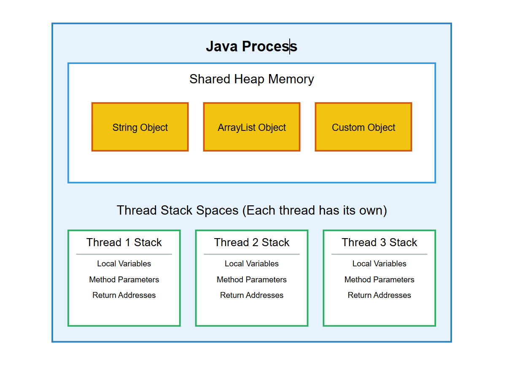
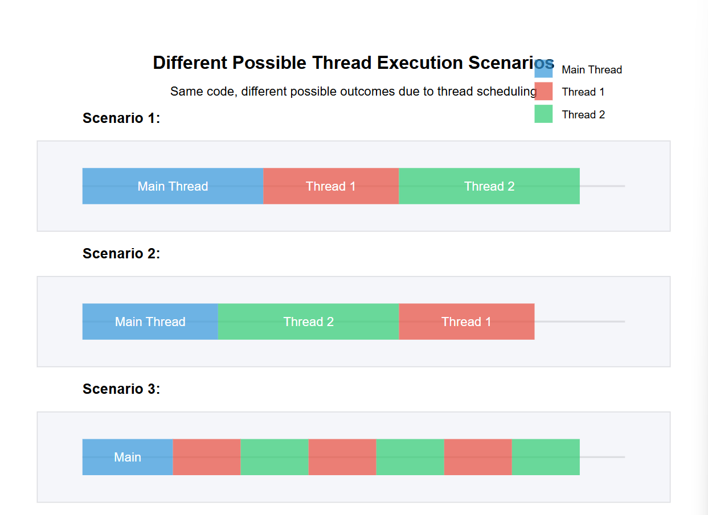
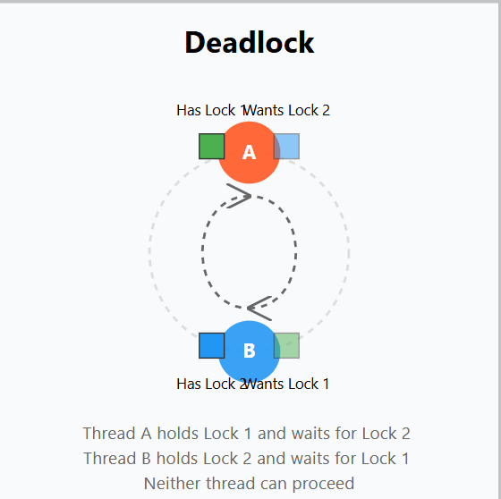
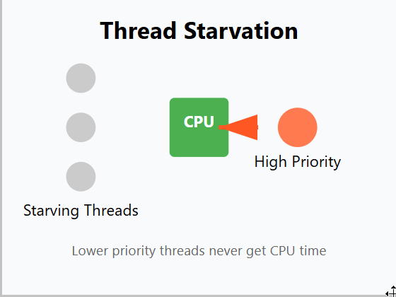
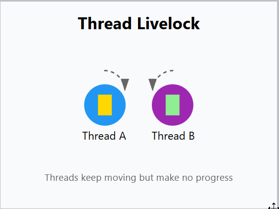
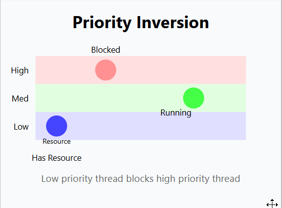

# Java Concurrency Notes

## What is it?
Concurrency lets us run multiple `threads` at the same time in our programs. When you write concurrent code, your application can handle multiple tasks simultaneously instead of doing everything one after another. This makes your programs faster and more responsive, since they can better use the computer's resources. Think of threads as independent workers that can each tackle a different part of your program's workload.

## Understanding Multitasking
Your computer can run multiple tasks at once - this is called multitasking. There are two key ways to make this happen:

1. Process-based Multitasking

   When each task runs as its own separate process, it gets its own dedicated memory space and resources. A great example is when you're running multiple programs - like when Spotify is playing music in one process while your game runs in another process. Each program operates independently.

2. Thread-based Multitasking

    Here's where things get interesting - threads are like lightweight processes that all live inside one main process. The cool thing about threads is they share the same memory space. This makes them much faster to create and switch between compared to full processes. When you're writing multithreaded code, your threads can work together on related tasks while sharing data and resources.


A key point to understand is that even though we talk about threads running "simultaneously", they might actually be taking turns really quickly on a single CPU core. True parallel execution happens when you have multiple CPU cores and your threads can genuinely run at the exact same time on different cores.


### Thread this. Thread That. So, What is thread. 
a thread is the smallest unit of processing that can be scheduled by an operating system. It's basically a sequence of programmed instructions that can run independently. Every Java program starts with at least one thread - the main thread that runs your `main()` method.

Things that makes them ✨special✨
- They have their own call stack for keeping track of method calls
- They can have their own local variables
- They share access to the objects created by your program
- The JVM and operating system work together to schedule when each thread gets to run

Enough text lets see an example. 

```java

Thread myThread = new Thread(() -> {
   System.out.println("Hello from a different thread!");
});

myThread.start();  // Don't call run() directly - start() creates the new thread

// Meanwhile, the main thread continues running here
System.out.println("Hello from the main thread!");
```

implementing the `Runnable` interface (this is usually the better approach since Java only allows extending one class) 


```java
// Using Runnable (preferred way)
public class MyTask implements Runnable {
   public void run() {
       // This is where you put the code you want the thread to execute
       System.out.println("Thread is running!");
   }
}

// Creating and starting the thread
Thread myThread = new Thread(new MyTask());
myThread.start();
```


as mentioned Threads share the same memory space and can access the same data. This can be a double-edged sword - it's great for sharing data between threads, but it can also lead to bugs if you're not careful. When multiple threads try to access the same data at the same time, you can run into issues like `race conditions` and `dead locks`.
1. race conditions: When two threads try to modify the same data at the same time, the results can be unpredictable. This can lead to bugs that are hard to reproduce and fix.
    Example code:
    ```java
        Map<Integer, String> map = new HashMap<>();
        Thread thread1 = new Thread(() -> {
        for (int i = 0; i < 10; i++) {
            map.put(i, "Value " + i);
            System.out.println("Thread 1: Added key " + i);
            try { Thread.sleep(50); } catch (InterruptedException e) {}
        }
        });

        Thread thread2 = new Thread(() -> {
        for (int i = 0; i < 10; i++) {
            // if (map.containsKey(i)) we "know" that the key is present in the map cuz we just added
            map.remove(i);
            System.out.println("Thread 2: Removed key " + i);
            try { Thread.sleep(50); } catch (InterruptedException e) {}
        }
        });

        thread1.start();
        thread2.start();

        thread1.join();
        thread2.join();

        System.out.println("Final map: " + map);
    ```
    It is problmatic to assume to order of which the threads will run. 

2. Deadlocks: When two threads are waiting for each other to release a resource, they can get stuck in a deadlock. This can happen if one thread locks resource A and waits for resource B, while the other thread locks resource B and waits for resource A. Both threads are now stuck waiting for each other to release the resources they need.


3. Starvation: When a thread is unable to gain regular access to the resources it needs to do its work, it can become starved. This can happen if other threads are constantly using the resources the starved thread needs, preventing it from making progress.



4. Livelock: When two or more threads are unable to make progress because they keep responding to each other's actions, they can get stuck in a livelock. This can happen if threads are constantly trying to avoid deadlocks by releasing and re-acquiring locks, but end up in a situation where they can't make progress.


5. Priority Inversion: When a lower-priority thread holds a resource that a higher-priority thread needs, the higher-priority thread can get stuck waiting for the lower-priority thread to release the resource. This can lead to suboptimal performance and responsiveness in your application.

## Thread Safety

Thread safety is all about making sure that your code works correctly when multiple threads are running at the same time. If your code isn't thread-safe, you can run into all sorts of problems(mentioned above and more).
How do we make our code thread-safe? Here are some common techniques:

1. Synchronization: This is the most basic way to ensure thread safety. You can use synchronized blocks or methods to make sure that only one thread can access a particular piece of code at a time


